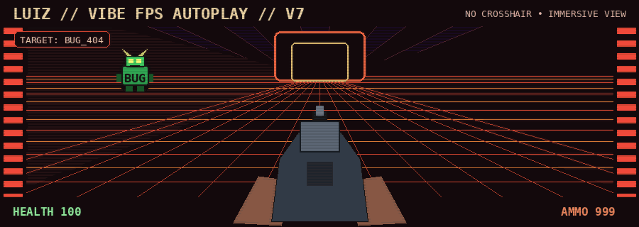
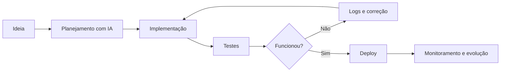

<h1 align="center">Olá, eu sou Luiz Augusto 👋</h1>

<h3 align="center">AI Automation Developer • Full Stack • Vibe Coder</h3>

<p align="center">
  Transformo ideias em produtos reais, funcionais e automatizados.<br>
  Da primeira conversa com a IA até o deploy, os testes e a evolução em produção.
</p>

<p align="center">
  
</p>

<p align="center">
  <strong>🎮 Modo automático:</strong> bugs detectados → bugs eliminados → projeto publicado.
</p>

---

## 👨‍💻 Sobre mim

- 🤖 Desenvolvedor focado em **IA, automações, SaaS e integrações**
- 🧠 Muito habilidoso em **Vibe Coding**, usando IA como copiloto para planejar, construir, testar, depurar e entregar sistemas complexos
- 🚀 Transformo ideias que estavam apenas no papel em aplicações reais e utilizáveis
- 🔌 Trabalho com APIs, bots, pagamentos, webhooks, filas, bancos de dados e sistemas multi-tenant
- 🛡️ Valorizo segurança, testes, observabilidade, performance, backup e rollback
- 🇧🇷 Desenvolvedor brasileiro

> **Vibe Coding com disciplina de engenharia:** não é apenas pedir código à IA — é entender o objetivo, quebrar o problema, validar cada etapa e insistir até funcionar.

---

## 🧩 Linguagens

<p align="left">
  
  
  
  
  
  
  
  
  
  
</p>

---

## 🛠️ Tecnologias e ferramentas

<p align="left">
  
  
  
  
  
  
  
  
  
  
  
</p>

**Também trabalho com:** APIs REST, webhooks, Telegram, WhatsApp, n8n, autenticação OAuth, pagamentos Pix, Mercado Pago, Efí Bank, Supabase, PostgreSQL, deploy em VPS, Caddy, ngrok e automações com IA.

---

## 🚀 O que eu construo

```text
🤖 Bots e automações inteligentes
💳 SaaS com pagamentos e assinaturas
📨 Integrações com Telegram e WhatsApp
🔗 APIs, webhooks e serviços multi-tenant
🧠 Fluxos com IA e agentes automatizados
🛡️ Sistemas com segurança, logs e recuperação
⚡ Otimizações de performance e experiência
```

---

## 📊 Estatísticas

<p align="center">
  
  
</p>

---

## 🧭 Meu processo



---

## 🤝 Conecte-se comigo

<p align="left">
  <a href="https://www.linkedin.com/in/luiz-augusto-dev/">
    
  </a>
  <a href="https://github.com/Luizaug1">
    
  </a>
</p>

---

<p align="center">
  <strong>“Uma ideia só vira produto quando alguém insiste até ela funcionar.”</strong>
</p>
