

  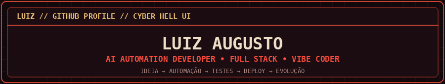

  

  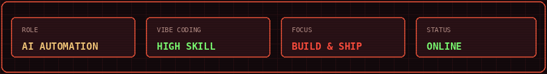

  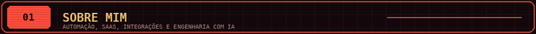

- 🤖 Desenvolvedor focado em **IA, automações, SaaS e integrações**
- 🧠 Muito habilidoso em **Vibe Coding**, usando IA para planejar, construir, testar, depurar e entregar sistemas complexos
- 🚀 Transformo ideias que estavam apenas no papel em aplicações reais e utilizáveis
- 🔌 Trabalho com APIs, bots, pagamentos, webhooks, bancos de dados e ambientes multi-tenant
- 🛡️ Valorizo segurança, logs, testes, performance, backup e rollback
- 🇧🇷 Desenvolvedor brasileiro

> **Vibe Coding com disciplina de engenharia:** entender o objetivo, dividir o problema, validar cada etapa e insistir até o sistema funcionar de verdade.

  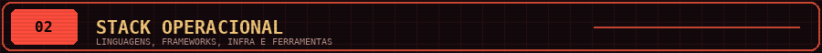

  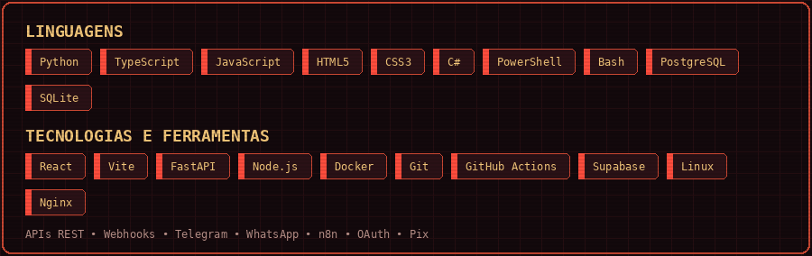

  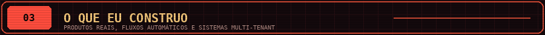

  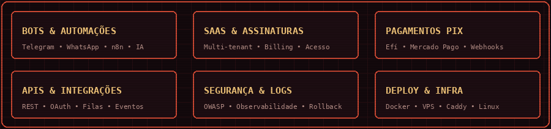

  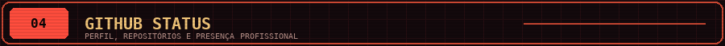

  <a href="https://github.com/Luizaug1">
    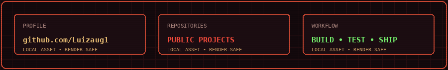
  </a>

  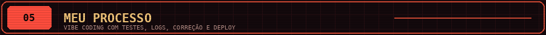

  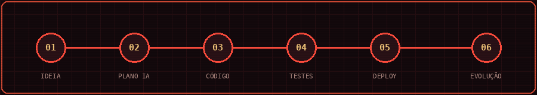

  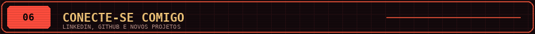

<table align="center">
  <tr>
    <td align="center">
      
    </td>
    <td align="center">
      
    </td>
  </tr>
</table>

  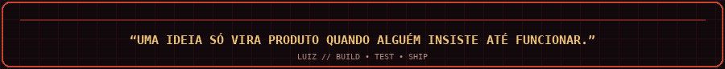

